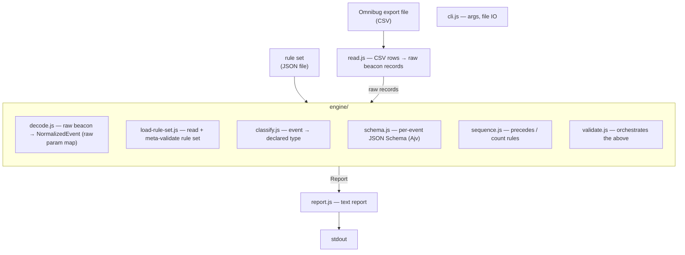
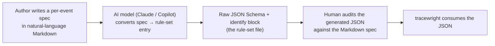

# tracewright — Design Document

**Status:** Draft for review. No implementation code exists yet.
**Scope:** architecture, rule-set format, authoring workflow, engine interface, parsing
approach, report format, repo layout, scope boundaries, and test-data discipline.

---

## 1. Goal and guiding constraint

`tracewright` is a command-line tool that reads a tracking-call capture **exported from
the [Omnibug](https://omnibug.io) browser extension** (CSV), validates the Adobe Analytics
/ Experience Cloud beacons in it against a configurable rule set, and prints a report.

One input, downloaded manually. No live capture, no network, no other formats.

The single most important design constraint:

> The **engine is generic**. It contains **no** hardcoded event names, field
> requirements, value rules, or ordering rules. Everything site-specific lives in a
> **rule set** — an external config file loaded at runtime.

A reviewer should be able to read every file under `src/` and learn nothing about any
particular website's tracking taxonomy. The only place a "checkout" or "purchase" ever
appears is in `examples/` and in rule sets users author themselves.

Three responsibilities, strictly separated:

1. **Read** an Omnibug CSV export into raw beacon records.
2. **Engine** — decode each raw beacon into a normalized event, then validate the list of
   events against whatever rule set it is handed.
3. **Rule sets** — declarative data describing one site's expected events, values, and
   sequence. The repo ships only generic, illustrative examples.

---

## 2. Scope: v1 vs v2 / future

v1 is deliberately small. Everything cut is recorded in §10 with rationale preserved, so
nothing is lost — just deferred.

**In v1:**
- Read an Omnibug **CSV** export (comma-delimited).
- Decode each Adobe beacon into a **single raw parameter map** (raw short codes, verbatim).
- Rule set: `eventTypes` (each with an `identify` matcher + a raw **JSON Schema**) and a
  `sequence` list using two rule kinds: **`precedes`** and **`count`**.
- Rule-set document **meta-validated on load** via Ajv against a published meta-schema.
- Pipeline: **classify → schema → sequence**.
- **Text** report to stdout.
- Unclassified beacons → **warning**, not failure.

**Deferred to v2+ (see §10):** TAB-delimited input, a friendly-name field map, structured
decoding (`events`/`products`/context data), JSON report output and CI exit codes,
additional sequence rules (`requires`, `forbids`, `first`, `last`), and session/page
grouping.

---

## 3. Architecture

### 3.1 Module map



### 3.2 The engine / rule-set boundary, made explicit

| Concern                                   | Lives in           | Never in |
|-------------------------------------------|--------------------|----------|
| How to read an Omnibug CSV export         | `read.js`          | —        |
| How to decode an Adobe beacon             | `engine/decode.js` | rule set |
| What a normalized event looks like        | `engine/` (shape)  | —        |
| Which params are required for event "X"   | rule set           | engine   |
| Allowed values / patterns for a field     | rule set           | engine   |
| "A must precede B", "C at most once"      | rule set           | engine   |
| How to evaluate a presence/value/seq rule | `engine/`          | rule set |

The engine knows rule *kinds* (presence, type, allowed-values, `precedes`, `count`). The
rule set supplies *instances* of those kinds. The engine is an interpreter; the rule set
is the program.

---

## 4. Reading the input

### 4.1 What an Omnibug CSV export contains

Omnibug's export (per its current source) is a **CSV** file: a metadata header line, then a
column header row, then one row per captured request. Columns:

```
Event Type | Provider | Account | Request ID | Request URL | POST Data | Timestamp | Notes
```

Critically, the export carries the **raw Request URL and POST Data** — Omnibug does *not*
expand parameters into friendly names on export (tracked upstream as Omnibug issue #120).
So `tracewright` decodes the beacon itself from the raw URL/POST.

`read.js` parses the comma-delimited file, skips the metadata line, maps columns by the
header row, and yields a raw record per row:

```js
{ provider, account, requestId, url, postData, timestamp, notes }
```

It keeps only Adobe rows (by the `Provider` column) and hands their `url` + `postData` to
the decoder. Non-Adobe rows are counted and skipped. The delimiter is isolated to a single
spot so TAB support (v2) is a one-line addition.

### 4.2 The public Adobe beacon format (decoded in `engine/decode.js`)

Each Adobe row's `Request URL` has the documented shape:

```
https://<host>/b/ss/<reportSuiteIDs>/<responseType>/<version>/s<cacheBuster>?<query>
```

The data is in the **query string** (or, for large beacons, the `POST Data` field as
`x-www-form-urlencoded`). Parameters use short codes documented in the public Adobe request
reference and the Omnibug open-source provider map. Examples:

| Param         | Meaning                | Notes                                   |
|---------------|------------------------|-----------------------------------------|
| `pageName`    | page name              |                                         |
| `events`      | events list            | comma-separated, e.g. `event1,scAdd`    |
| `products`    | products string        | a single opaque string in v1            |
| `cc`          | currency code          |                                         |
| `c1`…`c75`    | props (traffic vars)   |                                         |
| `v1`…`v250`   | eVars (conversion vars)|                                         |
| `g` / `r`     | page URL / referrer    |                                         |

Decoding is pure string/URL work using native `URL` and `URLSearchParams` — no Adobe SDK,
no network. v1 steps:

1. Parse the path: extract report suite IDs (informational).
2. Merge query string and POST body via `URLSearchParams` into a **single raw param map**,
   keys verbatim (`cc`, `v1`, `events`, `products`, …).
3. Emit a `NormalizedEvent` (§6).

v1 does **no** friendly-name aliasing and **no** structured decoding of `events`,
`products`, or context data — those values stay as their raw strings and are validated as
strings. (Both are v2; see §10.) Decoding is best-effort and non-throwing: a malformed
beacon yields a parse note on that event, not a crashed run.

Citations (all public) go in `docs/request-format.md`: Adobe's request-parameter reference
and the Omnibug project's open-source Adobe provider.

---

## 5. Rule-set format

### 5.1 Format choice

The rule set is **JSON** (zero parser dependency, native `JSON.parse`). It is
**meta-validated on load** against a published meta-schema (`src/rule-set.schema.json`) via
Ajv, so authors get clear errors for malformed rule sets.

### 5.2 Why Ajv (JSON Schema), not Zod

Field presence / type / allowed-value / pattern checks are exactly what **JSON Schema**
expresses, and **Ajv** is the mature, fast JSON Schema validator for Node. The deciding
factor is the core constraint: **rules are data loaded at runtime.**

- **Ajv / JSON Schema** — schemas are *data*. A rule author's file contains a JSON Schema
  object; the engine feeds it to Ajv. No code ships with the rule set. Perfect fit for "the
  engine is generic; the taxonomy is config," and JSON Schema is a documented,
  language-agnostic standard.
- **Zod** — schemas are *code* (JS/TS). Letting a rule set define shapes in Zod would mean
  shipping executable JS as config (a sandboxing problem) or building a config→Zod compiler
  that just reinvents JSON Schema. Zod's strength is static typing for code we write, which
  doesn't apply to schemas authored as config.

**Decision:** Ajv validates each event against a per-event JSON Schema, and meta-validates
the rule-set document itself. One dependency covers both. JSON Schema can't express
cross-event ordering/counting (it's per-document); that's the small sequence evaluator
(§5.5).

### 5.3 Concrete shape

Because v1 carries only the raw param map, schemas reference **Adobe's raw parameter codes**
(`cc`, `v1`, `c1`, …). Parameter values are always strings (from `URLSearchParams`), so a
"non-empty" check is `minLength`, and a numeric check is a `pattern` over a string. (A
friendly-name alias layer that would let schemas say `currencyCode` instead of `cc` is v2.)

```jsonc
{
  "name": "example-ecommerce-checkout",
  "description": "Illustrative checkout flow for a fictional store.",

  // Event-type catalogue. The key is an author-chosen logical event id.
  "eventTypes": {
    "addToCart": {
      // How to recognize this event among parsed beacons (keeps event names out of the engine).
      "identify": { "param": "events", "contains": "scAdd" },
      "schema": {                          // raw JSON Schema over the event's raw param map
        "type": "object",
        "required": ["products", "cc"],
        "properties": {
          "cc":       { "enum": ["USD", "EUR", "GBP"] },
          "products": { "type": "string", "minLength": 1 }
        }
      }
    },

    "purchase": {
      "identify": { "param": "events", "contains": "purchase" },
      "schema": {
        "type": "object",
        "required": ["products", "cc"],
        "properties": { "products": { "type": "string", "minLength": 1 } }
      }
    }
  },

  // Cross-event ordering / counting rules, evaluated over the whole export, in capture order.
  "sequence": [
    { "rule": "precedes", "before": "addToCart", "after": "purchase",
      "message": "A purchase must be preceded by at least one add-to-cart." },
    { "rule": "count", "event": "purchase", "max": 1 }
  ]
}
```

Key choices:

- **`identify` separates classification from validation.** Because normalized events are
  generic, the rule set tells the engine how to recognize each logical event type. This is
  what keeps event names out of the engine. A matcher is a primitive predicate
  (`param` + one of `equals` / `contains` / `matches` / `exists`), optionally composed with
  `all` / `any` / `not`. The full matcher is in v1.
- **`schema` is plain JSON Schema** over the raw param map.
- **`sequence` is a flat, ordered list** of declarative rules over logical event-type ids,
  each with an optional human `message`.

### 5.4 Authoring rule sets — the intended workflow (outside the engine)

Rule authors are **not** expected to hand-write JSON Schema. The intended authoring loop:



Example Markdown spec an author writes:

> **Event `addToCart`** — recognized when the `events` param contains `scAdd`.
> Requires `products` (non-empty) and `currencyCode` / `cc` (one of USD, EUR, GBP).

A model turns that into the `eventTypes.addToCart` entry shown in §5.3.

**Why JSON Schema is the generation target** (not an intermediate DSL):
- It is a documented standard that models generate reliably and consistently.
- A human can audit the generated JSON by eye against the Markdown spec.
- An intermediate DSL would add a compile step, a second failure surface, and a
  non-standard dialect that models generate *worse*.

**Critical boundary:** this loop lives entirely in the author's workflow. `tracewright`
does **not** contain a Markdown-to-schema generator — that is a usage pattern, not a
feature. The engine consumes only JSON Schema and stays fully generic; the IP boundary is
unchanged. No natural-language spec, model prompt, or taxonomy ever enters `src/`.

### 5.5 Sequence-rule vocabulary (v1)

| `rule`     | Fields                                | Meaning                                            |
|------------|---------------------------------------|----------------------------------------------------|
| `precedes` | `before`, `after`                     | every `after` has some `before` earlier in capture |
| `count`    | `event`, one of `exactly`/`min`/`max` | occurrence-count constraint                        |

Scope is the **whole export** (a manually captured trace is one session — no grouping in
v1). The vocabulary is additive — a new rule kind is a new pure evaluator
`(events, rule) → Violation[]` registered in `engine/sequence.js`. (More kinds in §10.)

---

## 6. Normalized event shape (v1)

The contract between the decoder and the rest of the engine:

```jsonc
{
  "index": 0,                       // position in the capture (0-based)
  "requestId": "7f3a",              // from the Omnibug row, for locating
  "timestamp": "2026-06-08T12:04:51Z", // from the Omnibug row
  "reportSuites": ["examplestore-prod"],

  "params": { "cc": "USD", "v1": "abc", "events": "scAdd", "products": ";Widget;1;9.99" },

  "parseNotes": []                  // non-fatal decode warnings, if any
}
```

`params` is the single raw map (no friendly map, no `decoded` block in v1). Schemas validate
`params`; sequence rules operate on the classified event-type id.

---

## 7. Engine public interface

Programmatic API (`src/index.js`), pure except for file IO:

```js
import { loadRuleSet, readExport, validate, formatReport } from 'tracewright';

const ruleSet = await loadRuleSet('./examples/rule-sets/ecommerce-checkout.json');
const events  = readExport(csvText);     // Omnibug CSV → NormalizedEvent[]
const report  = validate(events, ruleSet); // pure: (events, ruleSet) -> Report
process.stdout.write(formatReport(report)); // Markdown
```

`validate` runs three passes into one `Report`:

1. **Classify** each event to zero-or-one logical type via `identify`. Unclassified events
   are recorded as **warnings** and processing continues; an event matching two types is a
   rule-set authoring error.
2. **Schema** — validate each classified event's `params` against its type's JSON Schema via
   Ajv; map each Ajv error to a `Violation` with field path + expected/actual.
3. **Sequence** — run each `sequence` rule's evaluator over the classified stream.

---

## 8. Report format (v1: Markdown text)

The report is Markdown — readable in a terminal and pasteable straight into a file.
Per-beacon violations group under a beacon heading; cross-event violations group under
"Sequence rules"; unclassified beacons and skipped non-Adobe rows are notices; a summary
table closes the report.

```markdown
# tracewright report

**Rule set:** `example-ecommerce-checkout`

**Result:** ❌ 3 violations found.

## Beacon #3 — `purchase`

> request `7f3a`

- **schema** — required field missing: "cc"
- **schema** — field "products" must not be empty (got: `""`)

## Sequence rules

- **precedes** — A purchase must be preceded by at least one add-to-cart. (beacon #3)

## Notices

- ⚠️ Beacon #1 unclassified (no matching event type) — request `9b21`
- ℹ️ 1 non-Adobe row skipped

## Summary

| Metric | Count |
| --- | --- |
| Beacons checked | 5 |
| Passed | 1 |
| Unclassified | 1 |
| Non-Adobe skipped | 1 |
| Violations | 3 (2 schema, 1 precedes) |
```

Each violation carries: a stable `code` (`schema` / `precedes` / `count` / `ambiguous`), the
locating context (beacon index + request id, or the Sequence section), the offending field,
the author's `message` when present, and expected-vs-actual. Unclassified beacons appear as
notices and never fail the run.

v1 prints text to stdout and returns a non-zero exit code **only** for operational failures
(unreadable rule set or export). A violations-based exit code for CI gating, and JSON
output, are v2 (§10).

---

## 9. Repo structure and test-data discipline

### 9.1 Structure

```
tracewright/
  README.md                     overview, install, quick start, CLI usage
  LICENSE                       MIT
  package.json                  type: module; bin: tracewright; deps: ajv (+ ajv-formats)
  docs/
    design.md                   this document
    rule-set-format.md          authoring reference + the Markdown→schema workflow
    request-format.md           public Adobe/Omnibug param reference + citations
  src/
    cli.js                      args, file IO
    index.js                    public API re-exports
    read.js                     Omnibug CSV → raw beacon records
    rule-set.schema.json        meta-schema for rule-set documents
    engine/
      decode.js                 raw Adobe beacon → NormalizedEvent (raw param map)
      load-rule-set.js          read + meta-validate
      classify.js               identify-matcher evaluation
      schema.js                 Ajv wiring, error → Violation mapping
      sequence.js               precedes / count evaluators
      validate.js               orchestration → Report
    report.js                   text renderer
  examples/
    rule-sets/
      ecommerce-checkout.json   fictional, generic
    captures/
      checkout.csv              a small synthetic Omnibug CSV export
  test/
    decode.test.js
    classify.test.js
    schema.test.js
    sequence.test.js
    fixtures/
```

Dependencies, minimal and justified:
- **ajv** (+ **ajv-formats**) — JSON Schema validation for events and the rule-set
  meta-schema. Core to the design.
- Everything else (URL parsing, CSV splitting, arg parsing via `node:util parseArgs`, file
  IO) uses the Node standard library — no extra dependencies.

### 9.2 Test-data discipline (an authoring rule for this repo)

Everything under `examples/` is **synthetic — invented from scratch against the public Adobe
specification.** Concretely:

- `examples/captures/checkout.csv` is a **fictional store's** checkout trace: made-up
  values, **no** real report suites, **no** internal/real event names, and **no** parameters
  copied from any real captured trace.
- `examples/rule-sets/ecommerce-checkout.json` is likewise a **fictional** e-commerce flow.

No real-world or proprietary taxonomy, value, or capture ever enters the repo — not in code,
examples, tests, or fixtures. This rule is part of the project's public, open-source posture
and applies to every contribution.

---

## 10. v2 / future (deferred, with rationale)

| Item | Rationale for deferring / what it adds |
|------|----------------------------------------|
| **TAB-delimited input** | Omnibug also exports TAB. Trivial once the CSV delimiter is isolated in `read.js`; not needed to prove the design. |
| **Friendly-name field map** | Aliases raw codes → readable names (`cc` → `currencyCode`, `v1` → `eVar1`) so schemas and reports read naturally. Deferred to keep v1's normalized event a single raw map and avoid maintaining a code↔name table before the core is proven. |
| **Structured decoding** (`events` array, `products` positional split, context-data dotted keys) | Enables per-product and per-context-variable rules. Deferred because v1 validates these as opaque strings, which covers presence/pattern checks without the decoder complexity. |
| **JSON report output + CI exit codes** (0 ok / 1 violations / 2 usage) | Enables automation and CI gating. Deferred because v1's audience is a human reading a text report; the report model is designed to extend to JSON without rework. |
| **More sequence rules** (`requires`, `forbids`, `first`, `last`, immediate-precedence) | Richer ordering constraints. Deferred because `precedes` + `count` cover the common cases and the evaluator registry is additive. |
| **Session / page grouping for sequence scope** | Needed for multi-session captures. Deferred because a manually captured trace is one session, so whole-export scope is correct for v1. |
| **Report-suite / provider filtering** (`appliesTo`) | Restrict a rule set to matching beacons. Deferred as unnecessary for single-site manual traces. |

Each deferred item has a designated seam (isolated delimiter, single raw map, evaluator
registry, extensible report model) so adding it later is additive, not a rewrite.

---

*End of design. All previously open questions are resolved above. Awaiting your review — no
implementation code, scaffolding, or additional files until you approve this revision.*
